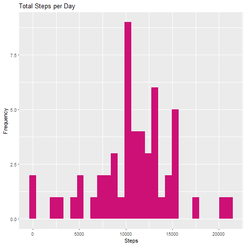
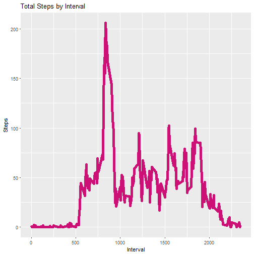
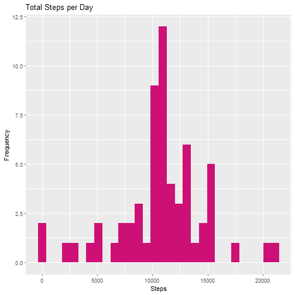
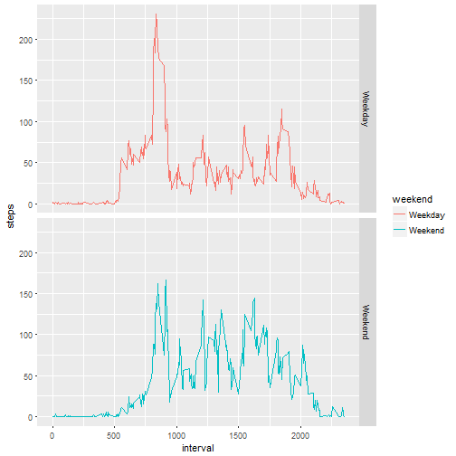

##***Loading and preprocessing the data***

```r
#read data
activitydata <- read.csv("activity.csv", header = TRUE, sep = ",")
head(activitydata)
```

```
##   steps       date interval
## 1    NA 2012-10-01        0
## 2    NA 2012-10-01        5
## 3    NA 2012-10-01       10
## 4    NA 2012-10-01       15
## 5    NA 2012-10-01       20
## 6    NA 2012-10-01       25
```

```r
dim(activitydata)
```

```
## [1] 17568     3
```

##***What is mean total number of steps taken per day?***

###1.Calculate the total number of steps taken per day.

```r
# Change date type to date class 
activitydata$date <- as.Date(as.character(activitydata$date))
activitydataNA <- is.na(activitydata$steps)
# Create data without NAs
activitydatatidy <- activitydata[!activitydataNA,]

# Aggregate clean non NA steps per day (SUM)
TotalDataByDay <- aggregate(activitydata$steps, by=list(activitydata$date), sum)
# Create column names
names(TotalDataByDay)[1] ="Date"
names(TotalDataByDay)[2] ="Steps"
head(TotalDataByDay,10)
```

```
##          Date Steps
## 1  2012-10-01    NA
## 2  2012-10-02   126
## 3  2012-10-03 11352
## 4  2012-10-04 12116
## 5  2012-10-05 13294
## 6  2012-10-06 15420
## 7  2012-10-07 11015
## 8  2012-10-08    NA
## 9  2012-10-09 12811
## 10 2012-10-10  9900
```

```r
#dimensions of full dataset
dim(TotalDataByDay)
```

```
## [1] 61  2
```

###2. Make a histogram of the total number of steps taken each day.

```r
library(ggplot2)

ggplot(TotalDataByDay, aes(x=Steps)) +geom_histogram(fill="deeppink3")+labs(title="Total Steps per Day", x="Steps", y="Frequency")
```

```
## `stat_bin()` using `bins = 30`. Pick better value with `binwidth`.
```

```
## Warning: Removed 8 rows containing non-finite values (stat_bin).
```



###3.Calculate and report the mean and median of the total number of steps taken per day


```r
mean(TotalDataByDay$Steps, na.rm = TRUE)
```

```
## [1] 10766.19
```

```r
median(TotalDataByDay$Steps, na.rm = TRUE)
```

```
## [1] 10765
```

##***What is the average daily activity pattern?***

###1. Make a time series plot (i.e.type="l") of the 5-minute interval (x-axis) and the average number of steps taken, averaged across all days (y-axis)


```r
#create subset without NAs
activitydatatidy <- activitydata[!activitydataNA,]
meanDataByInterval <- aggregate(activitydatatidy$steps,by=list(activitydatatidy$interval), mean)
# Create column names
names(meanDataByInterval)[1] ="interval"
names(meanDataByInterval)[2] ="steps"

ggplot(meanDataByInterval, aes(x = interval, y=steps)) +
  labs(title = "Total Steps by Interval", x = "Interval", y = "Steps") + geom_line(colour="deeppink3",size=2)
```



###2. Which 5-minute interval, on average across all the days in the dataset, contains the maximum number of steps?


```r
maxStepsInterval <- meanDataByInterval[which.max(meanDataByInterval$steps),]
maxStepsInterval
```

```
##     interval    steps
## 104      835 206.1698
```

##***Imputing missing values***

###1. Calculate and report the total number of missing values in the dataset (i.e. the total number of rows with NAs)

```r
countNaRows<- nrow(activitydata)- nrow(activitydatatidy)
countNaRows
```

```
## [1] 2304
```

###2. Devise a strategy for filling in all of the missing values in the dataset. The strategy does not need to be sophisticated. For example, you could use the mean/median for that day, or the mean for that 5-minute interval, etc.

```r
library(magrittr)
library(dplyr)

replaceNas <- function(x) replace(x, is.na(x), mean(x, na.rm = TRUE))
activitydata2 <- activitydata%>% group_by(interval) %>% mutate(steps= replaceNas(steps))
#show that there are no NA rows

sum(is.na(activitydata2$steps))
```

```
## [1] 0
```

###3. Create a new dataset that is equal to the original dataset but with the missing data filled in.

```r
#show first 6 rows of dataset created in previous section
head(activitydata2)
```

```
## # A tibble: 6 x 3
## # Groups: interval [6]
##    steps date       interval
##    <dbl> <date>        <int>
## 1 1.72   2012-10-01        0
## 2 0.340  2012-10-01        5
## 3 0.132  2012-10-01       10
## 4 0.151  2012-10-01       15
## 5 0.0755 2012-10-01       20
## 6 2.09   2012-10-01       25
```

###4a. Make a histogram of the total number of steps taken each day and Calculate and report the mean and median total number of steps taken per day. 

```r
TotalDataByDay2 <- aggregate(activitydata2$steps, by=list(activitydata2$date), sum)

names(TotalDataByDay2)[1] ="Date"
names(TotalDataByDay2)[2] ="Steps"
head(TotalDataByDay2,10)
```

```
##          Date    Steps
## 1  2012-10-01 10766.19
## 2  2012-10-02   126.00
## 3  2012-10-03 11352.00
## 4  2012-10-04 12116.00
## 5  2012-10-05 13294.00
## 6  2012-10-06 15420.00
## 7  2012-10-07 11015.00
## 8  2012-10-08 10766.19
## 9  2012-10-09 12811.00
## 10 2012-10-10  9900.00
```

```r
#dimensions of full dataset 
dim(TotalDataByDay2)
```

```
## [1] 61  2
```

```r
#plot histogram
ggplot(TotalDataByDay2, aes(x=Steps)) +geom_histogram(fill="deeppink3")+labs(title="Total Steps per Day", x="Steps", y="Frequency")
```

```
## `stat_bin()` using `bins = 30`. Pick better value with `binwidth`.
```



```r
#mean
mean(TotalDataByDay2$Steps, na.rm = TRUE)
```

```
## [1] 10766.19
```

```r
#median
median(TotalDataByDay2$Steps, na.rm = TRUE)
```

```
## [1] 10766.19
```

###4b. Do these values differ from the estimates from the first part of the assignment? 

The mean is the same but the median is slightly higher than when there were missing values.Compare results below.


```r
#compare mean before and after removing NA values
mean(TotalDataByDay$Steps, na.rm = TRUE)
```

```
## [1] 10766.19
```

```r
mean(TotalDataByDay2$Steps)
```

```
## [1] 10766.19
```

```r
#compare median before and after removing NA values
median(TotalDataByDay$Steps,na.rm =TRUE)
```

```
## [1] 10765
```

```r
median(TotalDataByDay2$Steps)
```

```
## [1] 10766.19
```

###4c. What is the impact of imputing missing data on the estimates of the total daily number of steps?

The median of the dataset is now equal to the mean.

##***Are there differences in activity patterns between weekdays and weekends?***

###1. Create a new factor variable in the dataset with two levels - "weekday" and "weekend" indicating whether a given date is a weekday or weekend day.

```r
#assigning weekday/ weekend tag to the 5 minute interval dataset
activitydata2$weekday <- weekdays(activitydata2$date)
activitydata2$weekend <- ifelse (activitydata2$weekday == "Saturday" | activitydata2$weekday == "Sunday", "Weekend", "Weekday")

head(activitydata2,15)
```

```
## # A tibble: 15 x 5
## # Groups: interval [15]
##     steps date       interval weekday weekend
##     <dbl> <date>        <int> <chr>   <chr>  
##  1 1.72   2012-10-01        0 Monday  Weekday
##  2 0.340  2012-10-01        5 Monday  Weekday
##  3 0.132  2012-10-01       10 Monday  Weekday
##  4 0.151  2012-10-01       15 Monday  Weekday
##  5 0.0755 2012-10-01       20 Monday  Weekday
##  6 2.09   2012-10-01       25 Monday  Weekday
##  7 0.528  2012-10-01       30 Monday  Weekday
##  8 0.868  2012-10-01       35 Monday  Weekday
##  9 0      2012-10-01       40 Monday  Weekday
## 10 1.47   2012-10-01       45 Monday  Weekday
## 11 0.302  2012-10-01       50 Monday  Weekday
## 12 0.132  2012-10-01       55 Monday  Weekday
## 13 0.321  2012-10-01      100 Monday  Weekday
## 14 0.679  2012-10-01      105 Monday  Weekday
## 15 0.151  2012-10-01      110 Monday  Weekday
```

```r
#assigning weekday/weekend tag to the daily interval set
TotalDataByDay2$weekday <- weekdays(TotalDataByDay2$Date)
TotalDataByDay2$weekend <- ifelse (TotalDataByDay2$weekday == "Saturday" | TotalDataByDay2$weekday == "Sunday", "Weekend", "Weekday")

head(TotalDataByDay2,15)
```

```
##          Date    Steps   weekday weekend
## 1  2012-10-01 10766.19    Monday Weekday
## 2  2012-10-02   126.00   Tuesday Weekday
## 3  2012-10-03 11352.00 Wednesday Weekday
## 4  2012-10-04 12116.00  Thursday Weekday
## 5  2012-10-05 13294.00    Friday Weekday
## 6  2012-10-06 15420.00  Saturday Weekend
## 7  2012-10-07 11015.00    Sunday Weekend
## 8  2012-10-08 10766.19    Monday Weekday
## 9  2012-10-09 12811.00   Tuesday Weekday
## 10 2012-10-10  9900.00 Wednesday Weekday
## 11 2012-10-11 10304.00  Thursday Weekday
## 12 2012-10-12 17382.00    Friday Weekday
## 13 2012-10-13 12426.00  Saturday Weekend
## 14 2012-10-14 15098.00    Sunday Weekend
## 15 2012-10-15 10139.00    Monday Weekday
```


###2. Make a panel plot containing a time series plot (i.e. type="l") of the 5-minute interval (x-axis) and the average number of steps taken, averaged across all weekday days or weekend days (y-axis). 


```r
#create Weekend and weekday subset dataframe
data.weekday <- activitydata2[activitydata2$weekend=="Weekday",]
data.weekend <- activitydata2[activitydata2$weekend=="Weekend",]

#Calculate mean of steps for 5 mins interval
weekdayinterval <- group_by(data.weekday, interval)
weekdayinterval <- summarize(weekdayinterval, steps=mean(steps))
weekdayinterval$weekend <- "Weekday"
weekendinterval <- group_by(data.weekend, interval)
weekendinterval <- summarize(weekendinterval, steps=mean(steps))
weekendinterval$weekend <- "Weekend"

#plot
activityinterval <- rbind(weekdayinterval, weekendinterval)
activityinterval$weekend <- as.factor(activityinterval$weekend)
ggplot(activityinterval, aes(interval, steps, color=weekend)) + geom_line() + facet_grid(weekend ~ .)
```



###At the beginning of the week, there is peak which drops and stays low . Over the weekend, there is a more uniform pattern.###


